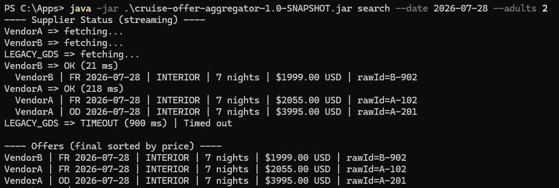
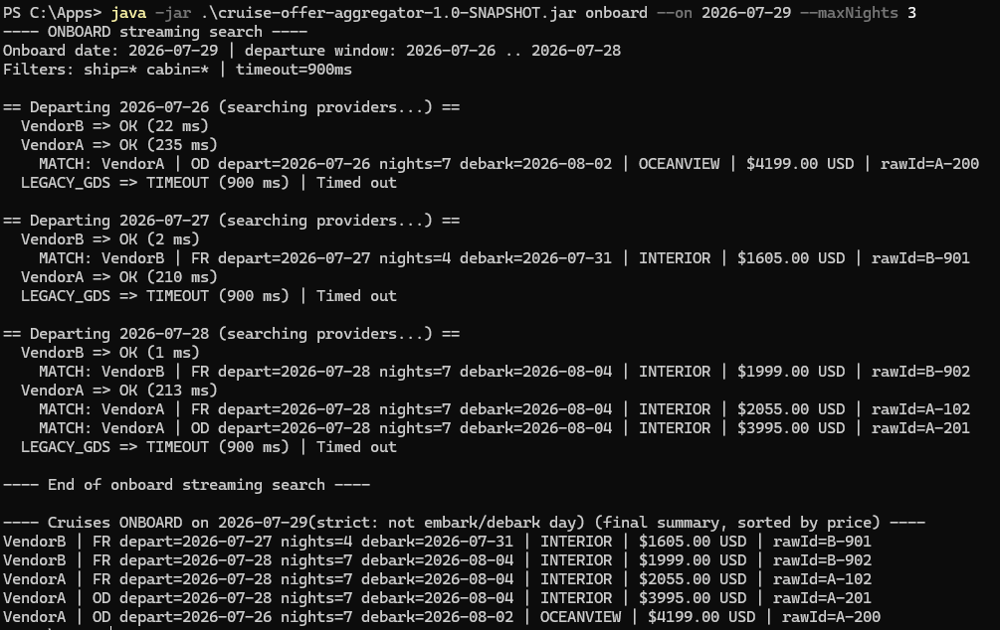

# Cruise Offer Aggregator (CLI Demo)

A small Java 21 project that simulates the core challenges behind cruise/travel booking systems: calling multiple external suppliers, dealing with slow/unreliable responses, normalizing inconsistent data, and persisting results with good integrity.

This is intentionally a **small-scale** and **fixture-driven** environment (no real network calls), but the structure is meant to resemble how such integrations are often approached in practice.

---

## What this project demonstrates

On a small, easy-to-run CLI, this project covers common problems a cruise booking platform faces:

1) **Integrating multiple suppliers**  
   Different formats (JSON “REST-like” and XML “SOAP-like”), inconsistent fields, and vendor-specific quirks.

2) **Latency and reliability of external calls**  
   Suppliers can be fast, slow, or fail. We handle timeouts and errors without crashing the whole search.

3) **Normalization (“mapping”)**  
   Supplier responses are mapped into a single internal model (`Offer`) so results can be compared and sorted consistently.

4) **Persistence + data integrity**  
   Searches and offers are stored in SQLite. Vendor health is recorded (last success/error) to help diagnose issues.

5) **Legacy SOAP / slow providers**  
   Includes a `DelayedSupplier` decorator that simulates a slow provider (`LEGACY_GDS`) to demonstrate `TIMEOUT` behavior and vendor health tracking.

6) **Multi-threading / progressive results**  
   Supplier calls run concurrently using `ExecutorCompletionService`, and the CLI prints results **as providers complete** (instead of waiting for all providers to finish).

---

## Special feature: "Onboard Date" search (family-event planning)

Most travel engines push users to search by **departure date/month**. Real families often plan around events like birthdays, anniversaries, or holidays.

This project adds an **Onboard Date** filter:

> Find cruises where you are **on the ship on a specific date**, excluding embark and debark days.

Example: “Show me cruises where I’m onboard on **2026-07-29**.”

### Why this is interesting
Cruise inventory is usually **departure-centric** (ship + departure date is the primary key). Many legacy APIs only support searching by a single departure date (worst-case scenario). This project implements onboard-date search by converting it into a bounded set of departure searches, then filtering results.

---

## Important premise (worst-case provider behavior)

This demo assumes providers support **departure-day searches only** (one departure date per request).  
That is a common “worst-case” constraint in older/legacy integrations.

If a provider supports **departure date ranges**, you can reduce calls from:

- **N days → 1 call per provider**

(That optimization is intentionally left out of the demo to keep the “hard case” realistic.)

---

## Tech stack

- Java 21
- Maven
- SQLite (via JDBC)
- Jackson (JSON parsing)
- XML parsing for SOAP-like fixtures
- Concurrency: `ExecutorCompletionService`
- Fat JAR packaging: Maven Shade
- Tests: JUnit 5

---

## Design patterns used 

This project uses a few common patterns you’ll see in integration-heavy systems:

- **Strategy (SupplierClient interface)**  
  Each supplier implements the same contract (`SupplierClient`) but can parse/behave differently (JSON vs SOAP, etc.).

- **Adapter (format-specific suppliers/parsers)**  
  “REST-like” JSON and “SOAP-like” XML are adapted into the same internal `Offer` model.

- **Decorator (`DelayedSupplier`)**  
  Wraps a supplier and adds artificial delay to simulate slow/legacy systems without changing supplier logic.

- **Repository (SQLite persistence layer)**  
  DB access is isolated in repository classes (runs/offers/vendor_health), keeping service logic clean.

- **Observer-style callback (`onUpdate`)**  
  The aggregator can push incremental results back to the CLI while other suppliers are still running.

- **Command-style CLI handlers**  
  CLI commands (`search`, `onboard`, `history`, `vendors`) are separated into handler methods for clarity and testability.

---

## Build & run

### Requirements
- Java 21+
- Maven 3.9+

### Build
```bash
mvn test
mvn package
``` 
## Usage

**Rule:** Options shown in **[brackets]** are optional. If omitted, no filtering is applied (i.e., “include all”).  
Dates use ISO format: `YYYY-MM-DD`.

### `search`
Departure-centric search (single sail date).

```bash
search --date YYYY-MM-DD [--ship CODE] [--cabin CLASS] [--adults N] [--children N] [--timeoutMs MS]
```

Defaults: `adults=2`, `children=0`, `timeoutMs=1500`

Example:
```bash
search --date 2026-07-25 --ship FR --cabin INTERIOR --adults 2 --children 1
```

### `onboard`
Find cruises where you are onboard on a date (excludes embark/debark day).  
Searches a departure window: `[onDate - maxNights .. onDate - 1]`

```bash
onboard --on YYYY-MM-DD [--maxNights N] [--ship CODE] [--cabin CLASS] [--adults N] [--children N] [--timeoutMs MS]
```

Defaults: `maxNights=14`, `adults=2`, `children=0`, `timeoutMs=1500`

Example:
```bash
onboard --on 2026-07-29 --ship FR --cabin INTERIOR --maxNights 14
```

### `history`
Show persisted offer history for ship + sail date.

```bash
history --ship CODE --date YYYY-MM-DD [--limit N]
```

Default: `limit=50`

Example:
```bash
history --ship FR --date 2026-07-25 --limit 20
```

### `vendors`
Show vendor health (last success/error).

```bash
vendors
```

---

## Project structure (high level)

- `cli/`  
  Argument parsing and command handlers (`search`, `onboard`, `history`, `vendors`)

- `service/`  
  Aggregation + concurrency + timeouts (`ExecutorCompletionService`), vendor status updates, streaming callbacks

- `suppliers/`  
  Supplier clients + parsers (REST-like JSON, SOAP-like XML), plus `DelayedSupplier` decorator

- `persistence/`  
  SQLite schema + repositories (runs, offers, vendor health)

- `domain/`  
  Core models (`Offer`, `SearchRequest`, `SearchResult`, `SupplierStatus`, etc.)

---

## Notes / future improvements

- Add provider date-range search to reduce onboard calls from **N days → 1 call per provider** when supported
- Add smarter caching separating **sailing discovery** (calendar) from **pricing quotes**
- Add a tiny HTTP API layer on top of the same service classes (keep CLI as a demo client)
- Add a small metrics summary (avg latency per vendor, timeout counts) for quick visibility

---

## Demo screenshots

> These screenshots show example output so you can quickly understand the behavior without compiling.

### `search` (progressive results + timeout handling)


### `onboard` (special day / onboard-date search)



